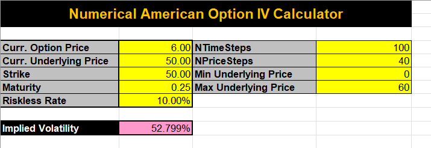

# Numerical American Option IV Calculator

## Overview

This project is a VBA Excel application designed to calculate the implied volatility of American options using numerical methods. It includes functions for American put option pricing and implied volatility estimation, leveraging the Crank-Nicolson method and the secant method.

<div style="display: flex; justify-content: space-between;">
  
</div>

## Features

- **American Option Pricing**: Utilizes numerical methods to accurately price American put options.
- **Implied Volatility Calculation**: Computes the implied volatility of American options using the secant method.
- **Excel Integration**: Easy-to-use interface within Microsoft Excel for financial modeling and analysis.

## Installation

1. **Clone the Repository:**

    ```sh
    git clone https://github.com/adibakshi28/Numerical_AmericanOption_IV.git
    ```

2. **Open in Excel:**
    - Open `Demo.xls` in Microsoft Excel.
    - Enable macros if prompted.

## Usage

1. **Load the VBA Module:**
    - Open the VBA editor in Excel (Alt + F11).
    - Import `AmericanOptionIVCalculator.vba`.

2. **Run the Calculations:**
    - Use the provided functions in the Excel sheet to calculate option prices and implied volatilities.

## Methods

- **Crank-Nicolson Method**: A finite difference method used for numerically solving the Black-Scholes PDE for American options.
- **Secant Method**: An iterative numerical method to estimate the implied volatility by finding the root of the pricing equation.

## Example

An example Excel sheet (`Demo.xls`) is included to demonstrate how to use the functions and perform calculations.

## Contributing

Contributions are welcome! Please fork the repository and submit pull requests for any improvements or bug fixes.

## License

This project is licensed under the MIT License. See the `LICENSE` file for details.

## Contact

For any questions or inquiries, please contact `adibakshi28`.
